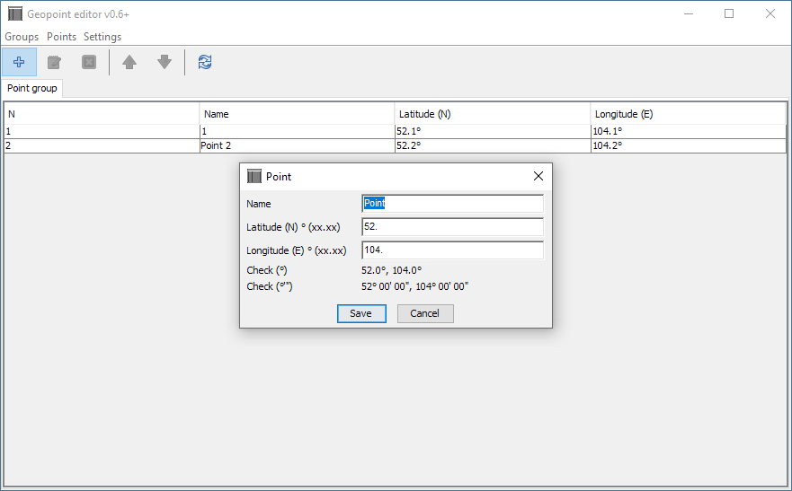

# malykh-geo-ep

My very simple application for quickly adding geopoints to KML/WPT files. It was written in Java 6 in 2009-2010.

I created it and used it to participate in off-road competitions. Then I quit, so the application was no longer needed.

Anton Malykh

See also:
- [Редактор точек](https://malykh.com/soft/geo-ep/)
- [malykh-geo-ep (2009-2010) source code](https://malykh.blogspot.com/2023/12/malykh-geo-ep-2009-2010-source-code.html)

